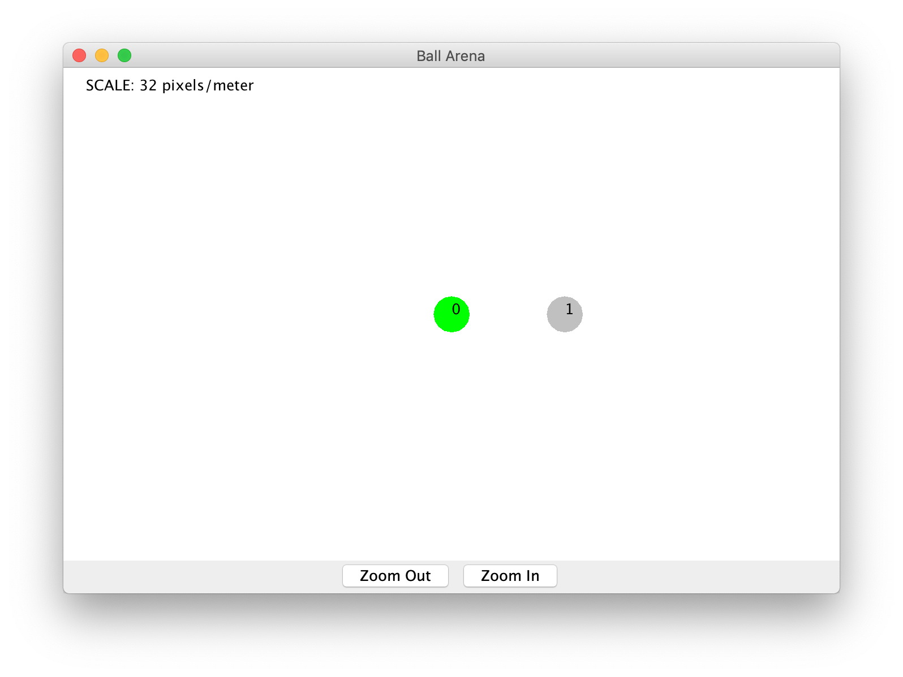

#SIM_contact

SIM_contact simulates the motion, and the collisions of any arbitrary numbers of moving balls.

Each ball is defined by a position, velocity, radius, and mass.

Collisions are purely elastic. In addition to conserving momentum, they also conserve kinetic energy.

A graphics client allows you to see the balls in motion:



##Examples
The configuration for the above display is:

```
dyn.contact.nballs = 2
dyn.contact.balls = trick.TMM_declare_var_1d("Ball*", dyn.contact.nballs)
dyn.contact.balls[0] = trick.make_Ball(0.0, 0.0,  0.5, 0.0, 0.5, 1.0)
dyn.contact.balls[1] = trick.make_Ball(3.0, 0.0, -0.5, 0.0, 0.5, 1.0)
```

The initial state of the first ball is pos=<0.0, 0.0>, vel=<0.5,0.0>, radius=0.5, and mass=1.0.

The initial state of the second ball is pos=<3.0, 0.0>, vel=<-0.5,0.0>, radius=0.5, and mass=1.0.