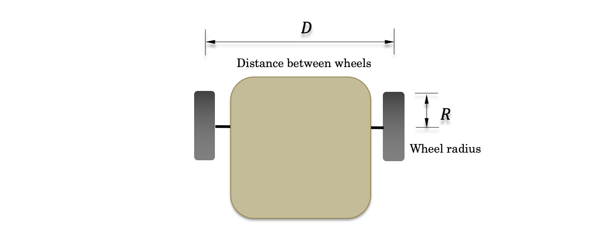

# Control

**Contents**

* [class DifferentialDriveController](#class-DifferentialDriveController)<br>
* [class VehicleController](#class-VehicleController)<br>

---

<a id=class-DifferentialDriveController></a>
## class DifferentialDriveController

### Description

The DifferentialDriveController controls the wheelbot's two drive motors so that it moves at a desired speed and heading.

The vehicle's heading-rate (&#120595;&#775;), and speed, or range-rate (V) are both functions of the left and right wheel speeds (radians/sec). We also need the radius of the wheels (R), and the distance between the wheels (D).


<a id=EQ_1_heading_rate></a>

<a id=EQ_2_range_rate></a>


| Access |Member Name            | Type   | Units  | Value  |
|---------|----------------------|--------|--------|--------|
| private |distanceBetweenWheels | double | m      | Constructor Parameter |
| private |wheelRadius           | double | m      | Constructor Parameter |

We're also constrained by the limitations of the motors, the vehicle, and the requirements of our design. Motors for example will be limited in speed.

| Access  | Member Name     | Type   | Units  | Value  |
|---------|-----------------|--------|--------|--------|
| private | wheelSpeedLimit | double | rad/s  | Constructor Parameter |

#### Allocating Wheelspeed to Forward Movement and Turning

The wheel speed limit, and equations [#1](#EQ_1_heading_rate) and [#2](EQ_2_range_rate), above mean that there's  a trade off between turning rate and speed. At maximum forward speed, the wheel speeds will be the same, and we won't be able to turn. Also, the more  quickly we want to turn, the more we have to slow down. So, we have to determine how we are going to "allocate" available wheel speed to turning and moving the vehicle.

#### Heading Rate Determination

First, we'll determine our desired heading rate. We'll make it proportional to the heading error (the difference between our desired heading and our actual heading), and subjected to a heading rate limit.

```
    Heading Rate PID controller goes here.
```

| Access  | Member Name        | Type   | Units  | Value  |
|---------|--------------------|--------|--------|--------|
| private | headingRateLimit   | double | rad/s  | Constructor Parameter |
| private | desiredHeadingRate | double | rad/s  | determined by Heading Rate PID controller|


#### Apportioning the Wheel Speed Limit

Given our desired heading rate ([Eq#1](#EQ_1_heading_rate)), we can determine the wheel-speed difference needed to achieve that.

<a id=EQ_3_wheel_speed_diff></a>


Because half of the difference is above the average, and half is below, half of the difference will be "allocated" from the wheelSpeedLimit for turning, with the remainder allocated to moving:

* [Eq#4] **wheelSpeedForHeadingRate** = (desiredHeadingRate * distanceBetweenWheels) / (2.0 * wheelRadius)

* [Eq#5] **availableWheelSpeedForRangeRate** = wheelSpeedLimit - ||wheelSpeedForHeadingRate||

#### Range Rate Determination

With **availableWheelSpeedForRangeRate** determined, we can figure our range rate. Within a  "slow-down distance" of a destination, we'll make it proportional to the distance error, otherwise it will be equal to our maximum available speed.

```
    Range Rate PID controller goes here.
```

| Access  | Member Name      | Type   | Units  | Value  |
|---------|------------------|--------|--------|--------|
| private | slowDownDistance | double | m      | Constructor Parameter |
| private | desiredRangeRate | double | m/s    | Range Rate PID controller |

#### Calculating the Required Motor Speeds

Now that we've apportioned the available wheel speed to turning and moving, we can figure our right and left wheel speeds:
 
* [Eq#6] **desiredRightWheelSpeed** =  wheelSpeedForRangeRate + wheelSpeedForHeadingRate
 
* [Eq#7] **desiredLeftWheelSpeed**  =  wheelSpeedForRangeRate - wheelSpeedForHeadingRate
    
Here, wheel speed is positive forward, and negative is backwards. For the motor models positive is counter clockwise, and negative is clockwise. So, we have to change sign for the right motor:

<a id=EQ_8_rightMotorSpeedCommand></a>
* [Eq#8] **rightMotorSpeedCommand** = -desiredRightWheelSpeed

<a id=EQ_9_leftMotorSpeedCommand></a>
* [Eq#9] **leftMotorSpeedCommand**  =  desiredLeftWheelSpeed

    
| Access  | Member Name           | Type   | Units  | Value  |
|---------|-----------------------|--------|--------|--------|
| private | rightMotorSpeedCommand| double | rad/s  |[Eq#8](#EQ_8_rightMotorSpeedCommand)|
| private | leftMotorSpeedCommand | double | rad/s  |[Eq#9](#EQ_9_leftMotorSpeedCommand)|

Finally, we set the commanded speeds for the right and left motors:

    rightMotorController.setCommandedSpeed( rightMotorSpeedCommand);
    leftMotorController.setCommandedSpeed( leftMotorSpeedCommand);

| Access  | Member Name           | Type   | Units  | Value  |
|---------|-----------------------|--------|--------|--------|
| private | rightMotorController  |[MotorSpeedController](../Motor/README.md#class-DCMotorSpeedController) | -- | Constructor Parameter   |
| private | leftMotorController   |[MotorSpeedController](../Motor/README.md#class-DCMotorSpeedController) | -- | Constructor Parameter   |

### Constructor

```
DifferentialDriveController( double distanceBetweenWheels,
                             double wheelRadius,
                             double wheelSpeedLimit,
                             double headingRateLimit,
                             double slowDownDistance,
                             MotorSpeedController& rightMotorController,
                             MotorSpeedController& leftMotorController
                           );
```

### Member Functions

```
        int update( double distance_err,
                    double heading_err);              
```

Determine the right and left motor speeds for the given distance, and heading errors, according to the algorithm described above.

```
        void stop();
```
Stop the vehicle.


---

<a id=class-VehicleController></a>
## class VehicleController

### Description

### Constructor

```
    VehicleController(std::vector<Point>* waypointQueue,
                      Navigator& navigator,
                      DifferentialDriveController& driveController,
                      double arrival_distance);
```

### Member Functions

```
int getCurrentDestination(Point& currentDestination);
```

```
void setWayPointQueue( std::vector<Point>* waypointQueue );
```

```
void printDestination();
```

```
void update();
```