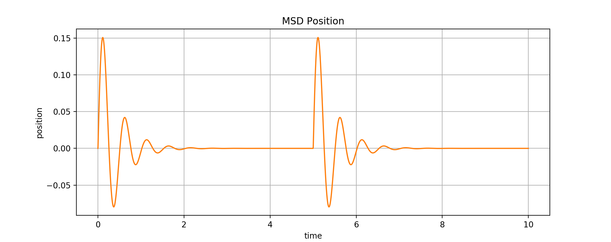

## MassSpringDamper

The MassSpringDamper program uses the SA::EulerCromerIntegrator class to
simulate a forced mass-spring-damper system.

### Initial conditions:

* mass = 1 kg.
* spring constant = 157.913670 N/m, gives a frequency of 2 hz.
* damping constant = 5 Ns/m.

### Run-time:

Every 5 seconds, the system is given an impulse of 500 Newtons for 0.005 seconds.

After each numerical integration time-step, the simulation program prints

1. time (s)
2. position (m)
3. velocity (m/s)

to ```stdout```, in Comma Separated Values (CSV) format.

### Building & Running the Simulation Program
To compile MassSpringDamper:

```
$ make
```
To run it, and generate a CSV file:

```
$ ./MassSpringDamper > msd.csv
```

### Plotting the Results
The Python script, ```plot_position.py``` is provided to plot the results in ```msd.csv``` using (Python) matplotlib.

Plot position vs. time as follows:

```
$ python plot_position.py
```


